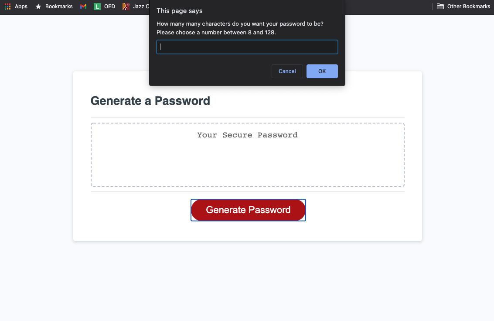
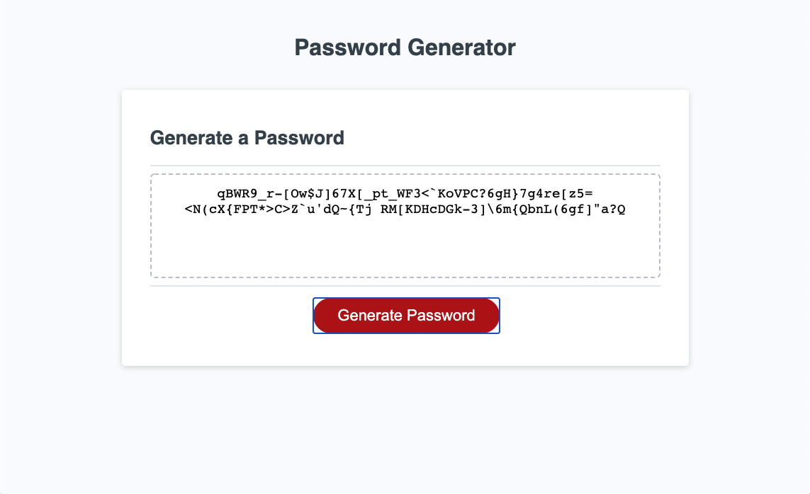
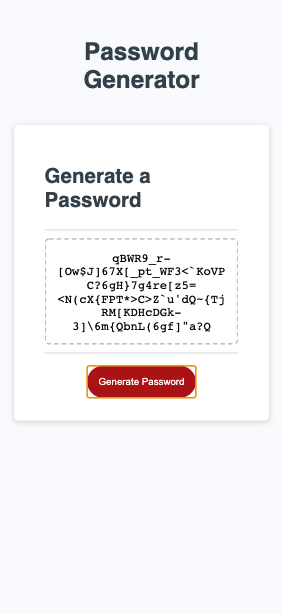

# password-generator

## Random Password Generator
This web application is fairly straightforward: the user clicks the "Generate Password" button, the user specifies the parameters of the password to be generated (i.e. the password's length and the character types to be included), and then a randomly generated password meeting those parameters is displayed on the screeen. 

If the user chooses a password length outside of the bounds of 8 and 128 characters, the user receives an alert prompting them to choose a length between 8 and 128 characters. If the user fails to specify at least one character type, the user receives an alert prompting them to choose at least one character type (i.e. lowercase letters, uppercase letters, numbers, and/or special characters). 

## Deployment 
To visit this website, simply follow this [link](https://rflctveq.github.io/password-generator/) or enter the following into your address bar: https://rflctveq.github.io/password-generator/. 

## Screenshots 
Here's two images of the application being run on a desktop-sized viewport: 

And here's an image of the application being run on a viewport the size of an iPhone X:

